# Autonomous Agent Architecture — Design Draft

사람의 인지적 작업 방식을 형식화하고, 도메인 무관한 자율 에이전트 행동 규칙으로 조합 가능하게 만든다.

## 1. 비전

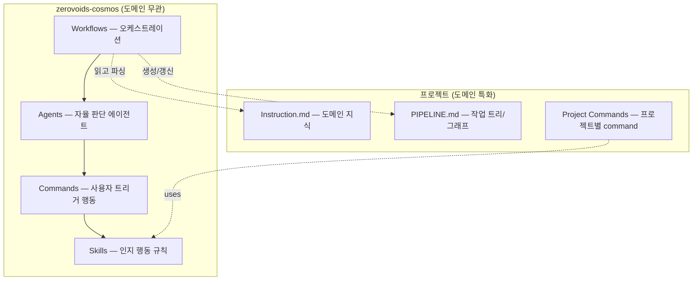

**핵심 분리**: 방법론(zerovoids-cosmos)과 도메인(프로젝트)은 완전히 분리된다. `npm install`로 방법론을 주입하고, `Instruction.md`로 도메인을 주입한다.

---

## 2. 인지 행동 (Cognitive Actions)

사람이 복잡한 프로젝트를 진행할 때 하는 "생각의 동작"을 열거한다.

### 2.1 Action 분류

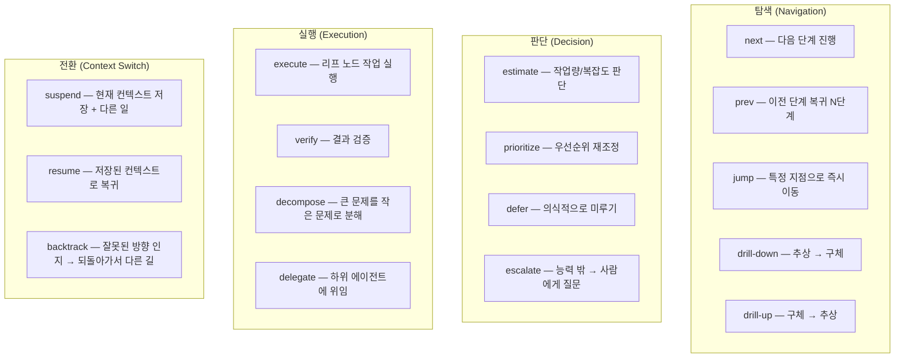

### 2.2 Action 상세

| Action | 설명 | 트리거 조건 | 관련 자료구조 |
|---|---|---|---|
| **next** | 자동 판단으로 다음 단계 진행 | 현재 노드 완료 또는 진입 시 | Stack (DFS) |
| **prev** | N단계 이전으로 되돌아감 | 사용자 명시 요청 | Stack |
| **jump** | 특정 노드로 즉시 이동, 현재 위치 저장 | 사용자 명시 또는 impact 감지 | Stack + Suspended |
| **drill-down** | 추상 노드 → 자식 노드로 진입 | 현재 노드에 미완료 자식 존재 | Tree |
| **drill-up** | 자식 전부 완료 → 부모로 복귀 | 형제 모두 `[x]` | Tree |
| **estimate** | 노드의 작업량/복잡도 판단 | 노드 최초 진입 시 | Priority Queue (weight 결정) |
| **prioritize** | 가중치 기반 순서 재조정 | estimate 후 또는 상황 변경 시 | Priority Queue |
| **defer** | "지금 안 해도 됨" — 의식적 미룸 | estimate 결과 낮은 우선순위 | Queue (후순위 삽입) |
| **escalate** | 능력 밖의 문제 → 사람에게 질문 | 반복 실패, 판단 불가 | — |
| **execute** | 리프 노드에서 실제 작업 수행 | 리프 도달 시 | — |
| **verify** | 작업 결과 검증 | execute 완료 후 | — |
| **decompose** | 큰 노드를 서브노드로 분해 | 노드가 너무 크다고 판단 시 | Tree (동적 자식 생성) |
| **delegate** | 하위 에이전트/command에 위임 | 독립적 서브태스크 식별 시 | — |
| **suspend** | 현재 컨텍스트 저장 + 다른 작업으로 전환 | jump, 블로커 발견 시 | Stack (LIFO) |
| **resume** | 저장된 컨텍스트로 복귀 | suspended 항목 존재 + 현재 작업 완료 | Stack (LIFO) |
| **backtrack** | 잘못된 경로 인지 → 되돌아가서 대안 선택 | verify 실패, 반복 실패 감지 | Stack + State rollback |

### 2.3 next 자동 판단 플로우

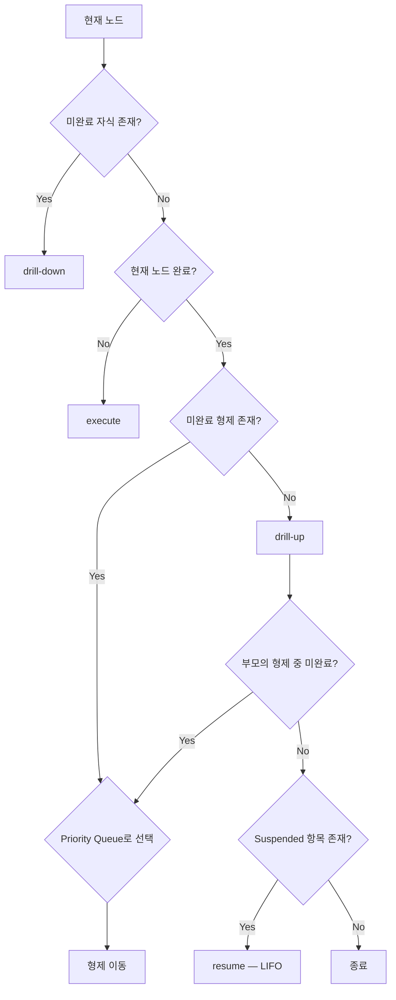

---

## 3. 자료구조 (Data Structures)

인지 행동이 작동하는 기반 구조. 각각이 skill로 규격화된다.

### 3.1 자료구조 맵

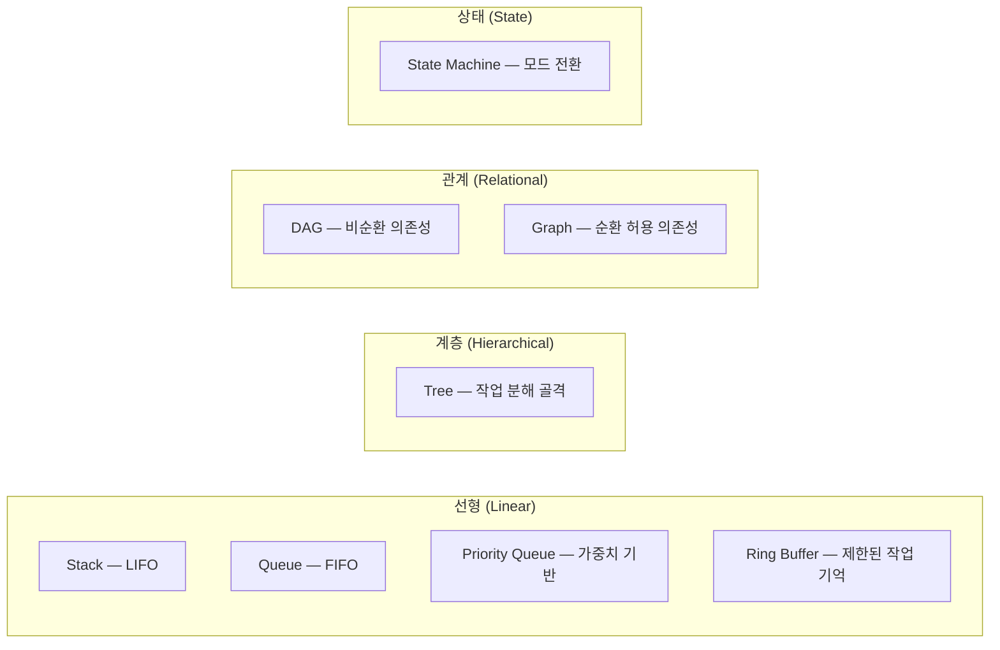

### 3.2 자료구조 → 인지 행동 매핑

| 자료구조 | 매핑되는 인지 행동 | 역할 |
|---|---|---|
| **Stack** | drill-down/up, suspend/resume, backtrack | 깊이 탐색, 컨텍스트 전환, 되돌리기 |
| **Queue** | 순차 실행, defer | 선형 파이프라인, 미룬 작업 후순위 처리 |
| **Priority Queue** | prioritize, next (형제 선택) | 가중치 기반 "다음에 뭐 할지" 결정 |
| **Ring Buffer** | 최근 컨텍스트 유지 | 토큰 제한 환경에서 작업 기억 관리 |
| **Tree** | decompose, progress tracking | 작업 분해의 골격, `[x]`/`[ ]` 진행 추적 |
| **DAG** | dependency resolution | 의존성 있는 작업의 실행 순서 결정 (topological sort) |
| **Graph** | impact propagation, cycle detection | cross-branch 영향 분석, 순환 감지 |
| **State Machine** | 에이전트 모드 전환 | coding → reviewing → debugging → testing |

---

## 4. 그래프 이론 & 순환 처리

### 4.1 Tree → Graph 진화

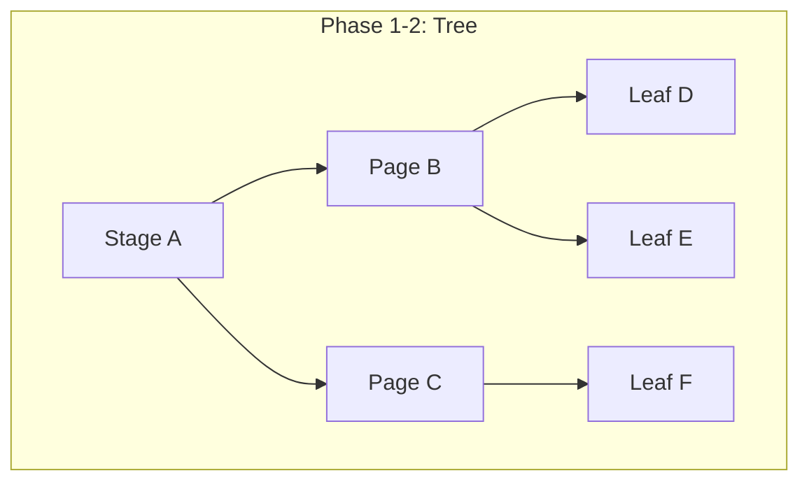

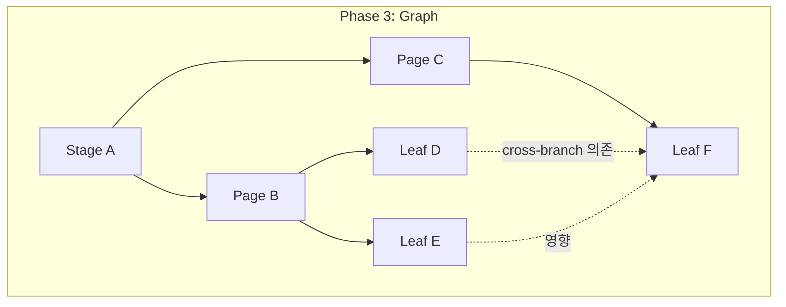

### 4.2 Cycle 처리 전략

사람의 사고에서 cycle은 존재한다. "수정 → 테스트 → 실패 → 수정"이 cycle이다.

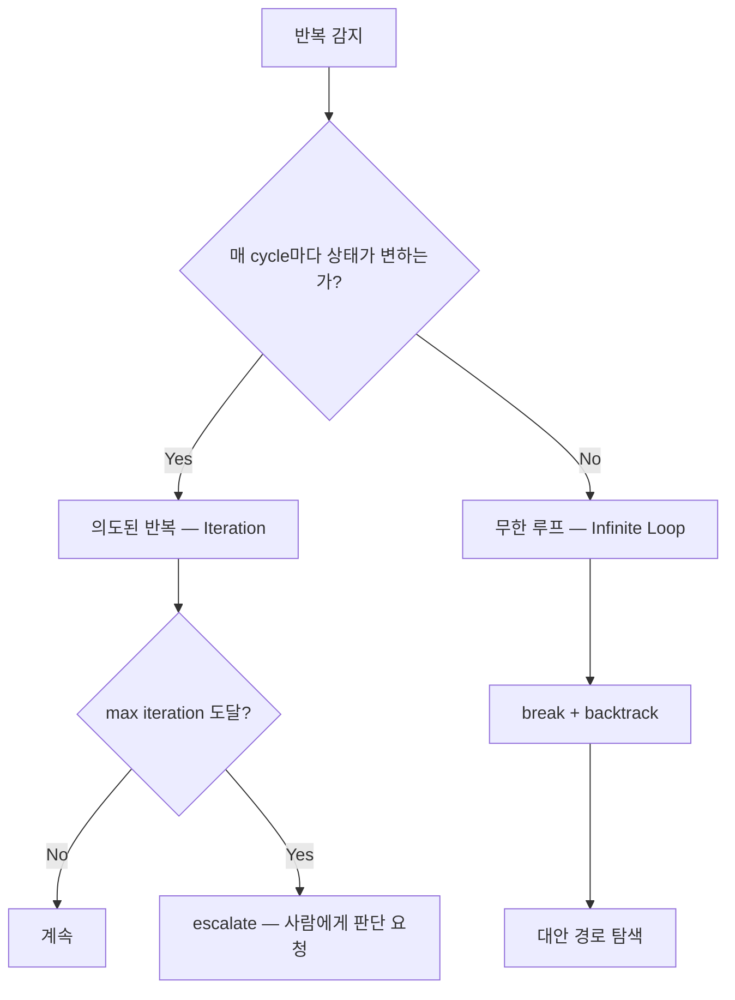

| 유형 | 판별 기준 | 처리 |
|---|---|---|
| **Iteration** (의도된 반복) | 매 cycle마다 상태(코드, 파일)가 변함 | 허용. max iteration 설정 |
| **Infinite Loop** (무한 루프) | 상태가 변하지 않는데 반복 | break → backtrack → 대안 경로 |
| **Oscillation** (진동) | A → B → A → B 반복 | N회 감지 시 escalate |

### 4.3 Impact Propagation

수정 발생 시 영향받는 노드를 최우선 처리한다.

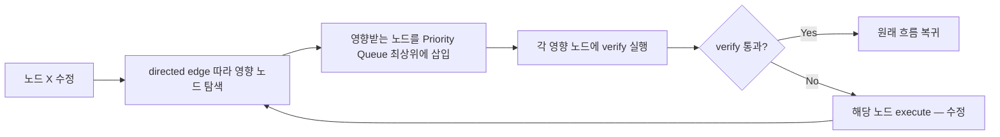

---

## 5. 자동화 인프라 (Automation Infrastructure)

100% 자율 실행을 위한 규칙들.

### 5.1 인프라 레이어

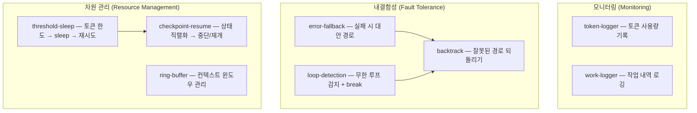

### 5.2 자동화 흐름

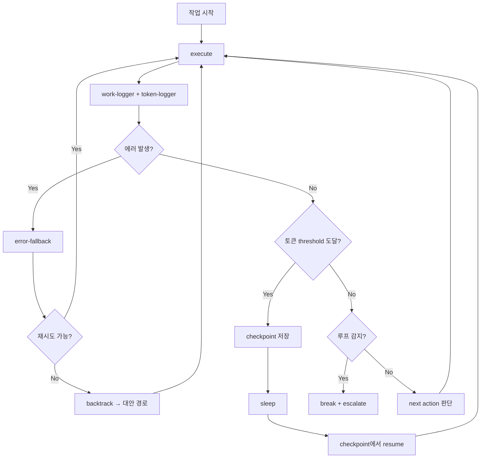

---

## 6. 페르소나 & 가중치 (Persona & Weighting)

### 6.1 페르소나 구조

개발자 페르소나는 다각적(multi-dimensional) 프로파일로 정의된다. 이 프로파일이 Priority Queue의 비교 함수를 결정한다.

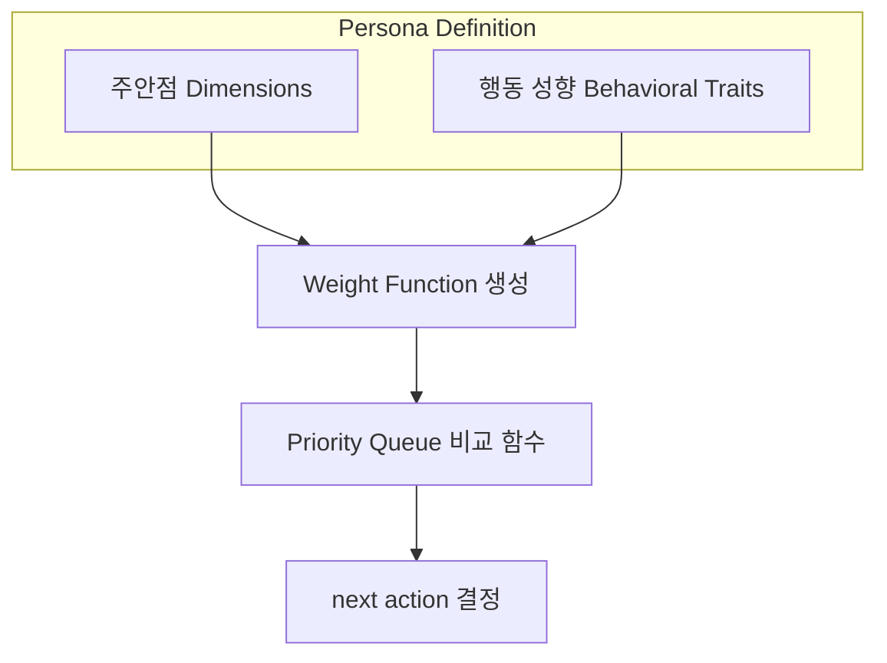

### 6.2 주안점 (Dimensions)

작업의 가치를 평가하는 축. 0.0 ~ 1.0 스케일.

| Dimension | 설명 | 높으면 | 낮으면 |
|---|---|---|---|
| `code-quality` | 코드 품질, 가독성, 패턴 준수 | verify 빈도 증가 | 빠른 통과 |
| `speed` | 작업 완료 속도 | defer/skip 적극 활용 | 꼼꼼한 진행 |
| `error-detection` | 에러 감지/방지 | verify + test 가중치 상승 | 낙관적 진행 |
| `test-coverage` | 테스트 커버리지 | 테스트 노드 weight 상승 | 구현 우선 |
| `maintainability` | 유지보수성, 문서화 | 리팩터링/문서 노드 weight 상승 | 기능 우선 |
| `security` | 보안 관점 | 보안 검증 노드 자동 삽입 | 생략 |

### 6.3 행동 성향 (Behavioral Traits)

action 선택 확률에 영향을 주는 성향.

| Trait | 설명 | 영향 |
|---|---|---|
| `risk-tolerance` | 위험 감수 정도 | low → verify 자주, high → skip 허용 |
| `depth-preference` | 깊이 vs 넓이 | deep → drill-down 선호, broad → 형제 우선 |
| `context-switch-cost` | 전환 비용 인식 | high → suspend 최소화, low → jump 자유 |
| `iteration-patience` | 반복 인내도 | high → max iteration 높음, low → 빠른 escalate |

### 6.4 Weight Function

```
weight(node) = Σ(dimension_i × relevance_i(node)) + trait_modifier

예시 — "품질 우선" 페르소나:
  code-quality: 0.9, speed: 0.3, error-detection: 0.8

  verify 노드:  0.9 × 0.8 + 0.3 × 0.1 + 0.8 × 0.9 = 1.47
  implement 노드: 0.9 × 0.5 + 0.3 × 0.9 + 0.8 × 0.3 = 0.96

  → verify가 implement보다 높은 priority
```

---

## 7. Skill 구조 제안

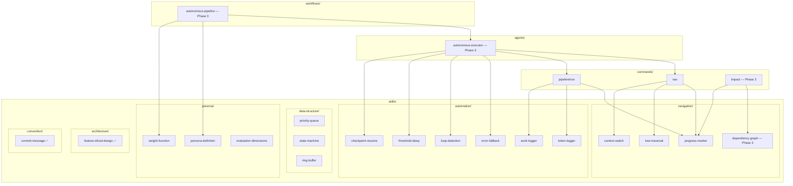

---

## 8. 구현 로드맵

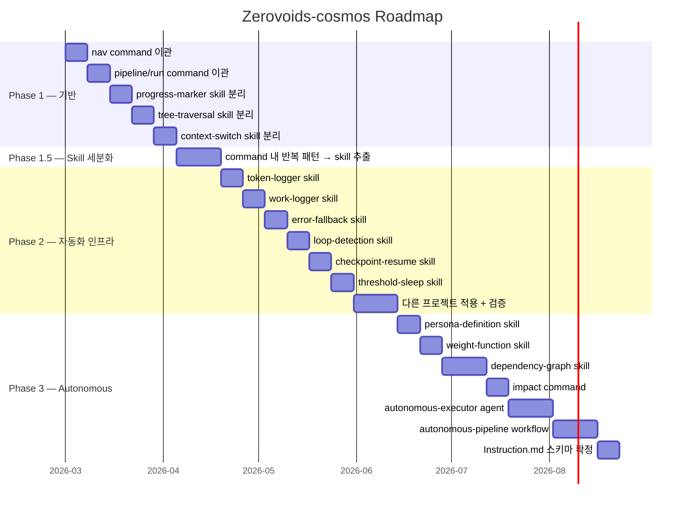

---

## 9. 학술적 배경

이 설계가 참조하는 기존 개념들.

| 개념 | 분야 | 이 프로젝트에서의 위치 |
|---|---|---|
| HTN (Hierarchical Task Networks) | AI Planning | decompose + tree-traversal |
| BDI (Belief-Desire-Intention) | Multi-Agent Systems | persona + weight-function |
| MCDM (Multi-Criteria Decision Making) | Operations Research | evaluation-dimensions + weight-function |
| Topological Sort | Graph Theory | dependency-graph (DAG 실행 순서) |
| Eigenvector Centrality | Network Science | dependency-graph (영향력 큰 노드 식별) |
| Iterative Deepening | AI Search | loop-detection + backtrack |
| Checkpoint-Restart | Distributed Systems | checkpoint-resume + threshold-sleep |

---

## 10. 미결정 사항

- [ ] Persona dimension 목록 확정 — 현재는 예시 수준
- [ ] Weight function 수식 확정 — 선형 조합 vs 비선형
- [ ] Ring buffer 크기 — 토큰 한도 기반 동적 조절?
- [ ] Iteration max count — 고정값 vs persona의 iteration-patience 기반
- [ ] Instruction.md 스키마 — 도메인 지식 주입 포맷
- [ ] State machine 상태 목록 — coding, reviewing, debugging, testing 외 추가?
- [ ] Impact propagation 깊이 — 몇 hop까지 추적할 것인가
- [ ] Graph에서 edge weight — 의존성 강도를 어떻게 정량화하는가
